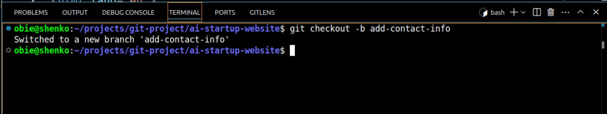

# AI-startup-website
### This project demonstrates the use of git version control system

## Install git
### Visit [Git Website](https://git-scm.com/downloads) download and install git.

Run `git --version` on the terminal to verifi git installation


## Signup or login to [Github](https://github.com)

#### Create a new repository named ai-startup-website


## Create a folder named 'git-project' on the terminal

#### Run the command `mkdir git-project` to a folder named git-project


#### Change directory to the one just created ` cd git-project`


## Clone the ai-startup-website repository

#### On the git-project directory clone the ai-startup-website repo. Run the command `git clone [url from the remote repository]`


#### Navigate to the just cloned repository
`cd ai-startup-website`

 

#### Create index.html file


#### Add content to the index.html file


#### Check if changes have been staged.
`git status`


#### Staged the changes on index.html root file

`git add index.html`


#### Confirm changes have been staged.

`git status`


#### Files in green color have been staged and ready to be committed to local repo.

#### Commit changes to local repository

`git commit -m"This is my first commit"`


#### Push the commited changes to main branch remote repo.

`git push origin main`


# Part 2 Simulating Tom and Jerry's Work
---

#### Navigate to the cloned ai-startup-website directory
`cd ai-startup-website`


#### Confirm current branch
`git branch`


#### Create a new branch 'update-navigation'

`git checkout -b update-navigation`


#### Run `git branch` to verify switch to update-navigation branch


#### Add the content _'This is Tom adding Navigation to the AI-website'_  to the index.html file


#### Run `git status` to see unstaged files in the update-navigation branch


#### Stage the untracked html file in the update-navigation branch

`git add index.html`


#### Run `git status` to verify that changes have been staged in the update-navigation branch


#### Commit Tom's changes to the update-navigation local branch

`git commit -m'Update navigation bar'`


#### Push Tom's branch to remote github repo
`git push origin update-navigation`


# Simulate Jerry's contribution to the project

#### Switch back to the main branch

`git checkout main`


#### Pull the latest changes from the update-navigation branch

`git pull origin update-navigation`


#### Create a branch for Jerry's Work named add-contact-info

`git checkout -b add-contact-info`



#### Open the index.html file and add contact info

```html
<form action="#" method="POST" class="formcarry-form">
        <label for="name">Your Name</label>
        <input type="text" id="name" name="fullName" required />
        <label for="email">Your Email Address</label>
        <input type="email" id="email" name="email" required />
        <label for="message">Your Message</label>
        <textarea name="message" id="message" cols="15" rows=""></textarea>
        <button type="submit">Send</button>
</form>
```

#### Stage Jerry's changes
`git add index.html`


#### Commit Jerry's changes

`git commit -m'Add contact information'`


#### Push Jerry's branch to github

`git push origin add-contact-info`


## Here is the Github repository showing branches.


# Part 3 Merging Changes

### Pull Request from github


### Pull request created


### Merge update-navigation to main branch


## Updating Jerry's branch with latest changes

### On the terminal use the following command to switch to Jerry's branch

`git checkout add-contact-info`


### Pull the latest changes from main to add-contact-info branch

`git pull origin main`


## Finalizing Jerry's Contribution

### Push Jerry's updated branch to Github


